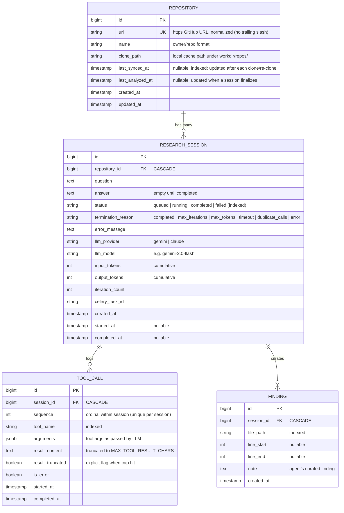

# Database ERD

```mermaid
erDiagram
    REPOSITORY ||--o{ RESEARCH_SESSION : "has many"
    RESEARCH_SESSION ||--o{ TOOL_CALL : "logs"
    RESEARCH_SESSION ||--o{ FINDING : "curates"

    REPOSITORY {
        bigint id PK
        string url UK "https GitHub URL, normalized (no trailing slash)"
        string name "owner/repo format"
        string clone_path "local cache path under workdir/repos/"
        timestamp last_synced_at "nullable, indexed; updated after each clone/re-clone"
        timestamp last_analyzed_at "nullable; updated when a session finalizes"
        timestamp created_at
        timestamp updated_at
    }

    RESEARCH_SESSION {
        bigint id PK
        bigint repository_id FK "CASCADE"
        text question
        text answer "empty until completed"
        string status "queued | running | completed | failed (indexed)"
        string termination_reason "completed | max_iterations | max_tokens | timeout | duplicate_calls | error"
        text error_message
        string llm_provider "gemini | claude"
        string llm_model "e.g. gemini-2.0-flash"
        int input_tokens "cumulative"
        int output_tokens "cumulative"
        int iteration_count
        string celery_task_id
        timestamp created_at
        timestamp started_at "nullable"
        timestamp completed_at "nullable"
    }

    TOOL_CALL {
        bigint id PK
        bigint session_id FK "CASCADE"
        int sequence "ordinal within session (unique per session)"
        string tool_name "indexed"
        jsonb arguments "tool args as passed by LLM"
        text result_content "truncated to MAX_TOOL_RESULT_CHARS"
        boolean result_truncated "explicit flag when cap hit"
        boolean is_error
        timestamp started_at
        timestamp completed_at
    }

    FINDING {
        bigint id PK
        bigint session_id FK "CASCADE"
        string file_path "indexed"
        int line_start "nullable"
        int line_end "nullable"
        text note "agent's curated finding"
        timestamp created_at
    }
```
